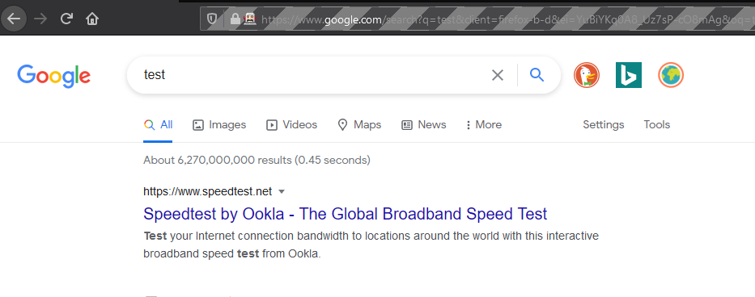
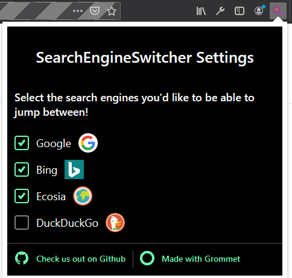

# SearchEngineSwitcher

This is a web extension, built for Chrome and Firefox, allowing users to more easily switch between search engines by embedding links between them.
The following search engines are supported currently:
 - Google
 - DuckDuckGo
 - Ecosia
 - Bing

It contains a content_script, responsible for embedding links to the other enabled search engines when the user is browsing on one of the enabled search engines. Here's a picture of what the embedded links look like on Google, as an example. The extension adds clickable icons to the other search engines to the right of the search area.

The extension also contains a popup, where users can toggle which of the supported search engines are enabled. Here it is in darkmode!

## Local Development

Requires [Node.js](https://nodejs.org/) 20 or later.

1. Install dependencies: `npm install`
2. Start development build with file watching:
   - **Chrome:** `npm run dev:chrome` — then load `extension/chrome` as an unpacked extension at `chrome://extensions`
   - **Firefox:** `npm run dev:firefox` — then load `extension/firefox/manifest.json` as a temporary add-on at `about:debugging`
3. Build production artifacts: `npm run build` (or `npm run build:chrome` / `npm run build:firefox` individually)
   - Outputs `extension/chrome.zip` and `extension/firefox.xpi`

## Built With

This extension is built on top of [abhijithvijayan/web-extension-starter](https://github.com/abhijithvijayan/web-extension-starter) — a Manifest V3, cross-browser web extension template using Vite, React, and TypeScript.

---
If you have an issues using the extension, or would like to make a feature request, feel free to raise an issue and I will get to it ASAP!
This README is a work in progress and will see more love soon!